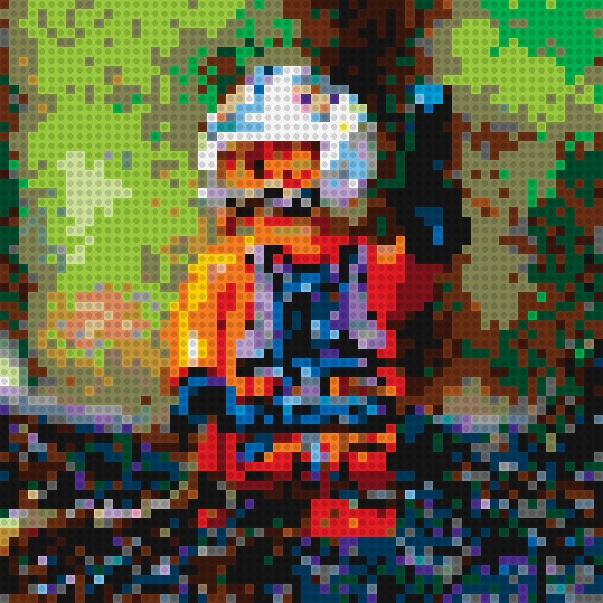
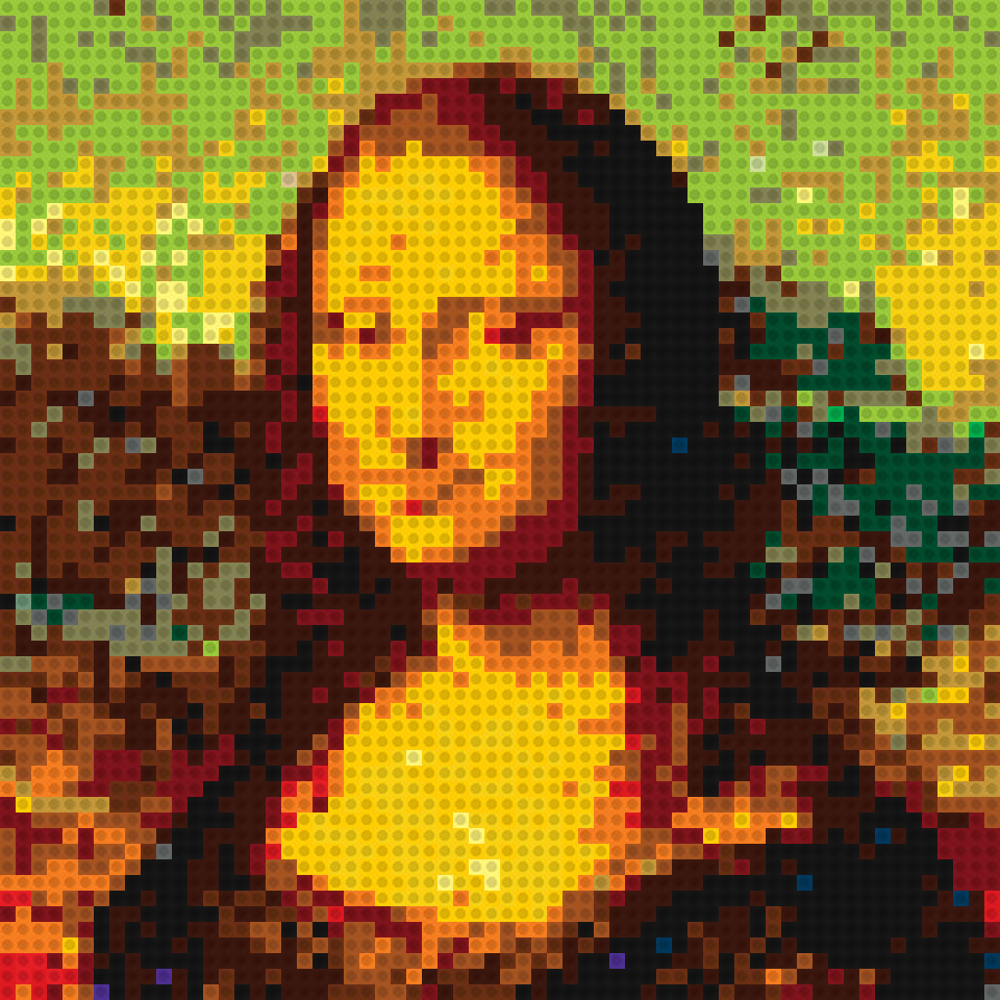

# LegoBricks
A script to generate csv files in python. The csv files contain information about the type, position and color of different lego bricks. Those values can be used in blender or any other application to create 3d images out of legobrick objects.

## Usage
python3 legoBricks.py imagefile resolution colourpalette contrast (optional) saturation (optional)

python3 legoBricks.py IMG.4193.jpg 64 full 1.5 2.0
### resolution
Resolution defines the width of the image, height gets calculated in the script.
Needs to be integer. Optimal values are 32 or 64.
### colourpalette
1. greyscale - greyscale lego colour palette
2. simple - simplyfied lego colour palette
3. full - full lego colour palette
### contrast
Changes contrast of the input image.
### saturation
Changes saturation of the input image.

