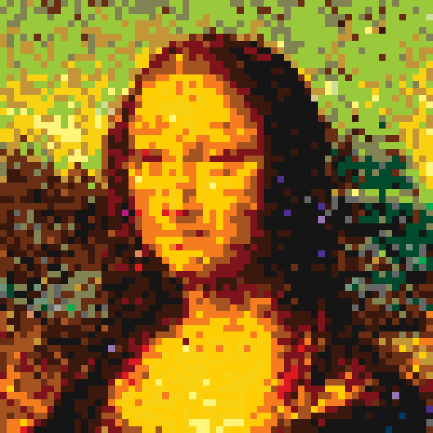

# LegoBricks
A script to generate csv files in python. The csv files contain information about the type, position and color of different lego bricks. Those values can be used in blender or any other application to create 3d images out of legobrick objects.

## Usage
python3 legoBricks.py imagefile resolution colourpalette

### resolution
resolution defines the width of the image, height gets calculated in the script
### colourpalette
1. Greyscale - greyscale lego colour palette
2. Simple - simplyfied lego colour palette
3. Full - full lego colour palette
